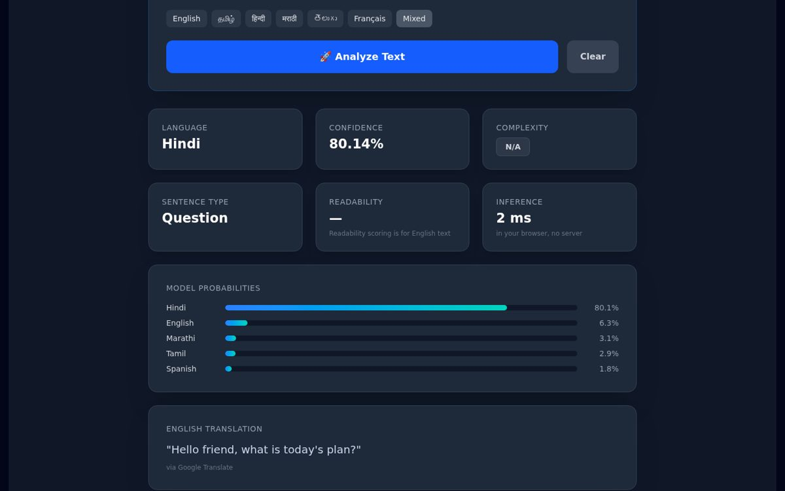
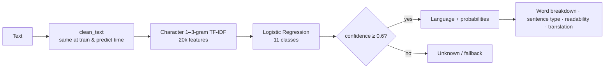

# 🌍 NLP Language Detection System

**Live demo → https://shivesh900.github.io/nlp-project/**

Detects **11 languages** — English, Tamil, Hindi, Telugu, Kannada, Malayalam, Bengali,
Marathi, French, Spanish and German — and analyses the text: confidence per language,
word-by-word breakdown (great for code-mixed text like *"Hello நண்பா, आज का plan क्या है?"*),
sentence type, readability (Flesch Reading Ease) and an English translation.

The scikit-learn model is **exported to JSON and runs in your browser**, so the live demo
needs no server; the same model also powers the Flask API and the Streamlit dashboard.



## Results (measured)

Held-out test set: **794 Wikipedia sentences from articles the model never saw**
(train/test split by article, `train_model.py`, numbers in [`reports/metrics.json`](reports/metrics.json)):

| Metric | Value |
|---|---|
| Accuracy | **98.9 %** |
| Macro F1 | 98.6 % |
| Accuracy on only the first 3 words | 90.7 % |
| Accuracy on a single word | 80.2 % |

| Language | F1 |
|---|---|
| Bengali | 1.000 |
| English | 0.968 |
| French | 0.993 |
| German | 0.955 |
| Hindi | 0.985 |
| Kannada | 1.000 |
| Malayalam | 1.000 |
| Marathi | 0.981 |
| Spanish | 0.969 |
| Tamil | 1.000 |
| Telugu | 1.000 |

The few remaining errors are between languages that share a script: Hindi ↔ Marathi
(both Devanagari) and English / French / Spanish / German (all Latin). Scripts alone make
Tamil, Telugu, Kannada, Malayalam and Bengali easy. For reference, the v1 model (3
languages, 192 hand-written sentences) also scored 100 % on the English/Tamil/Hindi part of
this test set — those three use different scripts — but it could not tell any other
language apart. The browser model gives the **same prediction as Python on all 4,216
sentences** checked (`scripts/check_web_parity.py`, max probability difference 0.0002).

## How it works



- **Data** – the 192 curated v1 sentences ([`data/curated_sentences.csv`](data/curated_sentences.csv))
  plus 4,019 sentences from the intros of 1,440 random Wikipedia articles
  ([`data/wikipedia_sentences.csv`](data/wikipedia_sentences.csv), CC BY-SA, rebuilt with
  `python scripts/build_dataset.py`).
- **Model** – `TfidfVectorizer(analyzer="char", ngram_range=(1, 3))` +
  `LogisticRegression(class_weight="balanced")`, as in v1, with `min_df=2` and 20k features.
- **Browser** – `train_model.py` writes `frontend/public/model.json` (vocabulary, IDF,
  coefficients); [`frontend/src/nlp/model.js`](frontend/src/nlp/model.js) re-implements
  scikit-learn's char n-grams, TF-IDF + L2 norm and softmax in ~100 lines of JavaScript.
- **Rules from v1, kept** – gibberish check, "Unknown" below 60 % confidence (90 % for a
  single word), sentence type from punctuation, readability only for English.
- **Translation** – Google Translate (public endpoint) with MyMemory as a fallback; the
  Python side uses `deep-translator`.

## Run it

```bash
python -m venv .venv && source .venv/bin/activate
pip install -r requirements.txt

python train_model.py          # retrain + evaluate + export (≈10 s)
pytest -q                      # 19 tests: every language, edge cases, Flask API
python scripts/check_web_parity.py

python app.py                  # Flask API  → http://localhost:5000/predict
streamlit run streamlit_app.py # dashboard

cd frontend && npm install && npm run dev   # React app with the in-browser model
```

### API

`POST /predict` with `{"text": "..."}` →
`{"language", "confidence", "source", "translation", "word_level", "complexity", "readability_score", "sentence_type"}`;
`GET /health`.

## What changed from v1

- Training used raw text but prediction used cleaned text (train/serve skew) — both now use `utils/text.py`.
- `requirements.txt` was missing Flask, flask-cors and gunicorn, so `app.py` and the `Procfile` couldn't start.
- The React frontend was unstyled (Tailwind v3 directives with the v4 PostCSS plugin) and needed the Flask server; it now runs the model itself.
- The langdetect fallback could label "Hi" as Dutch ("NL"); it now only accepts supported languages.
- No evaluation existed — there is now a held-out test set, metrics, 19 Python tests, 3 JS tests, a Python↔JS parity check and CI that deploys to GitHub Pages.

## Tech stack

Python · scikit-learn · pandas · Flask · Streamlit · langdetect · textstat · deep-translator ·
React 19 · Vite · Tailwind CSS 4 · GitHub Actions · GitHub Pages

Built by **Shivesh Haran P** — [github.com/shivesh900](https://github.com/shivesh900)
